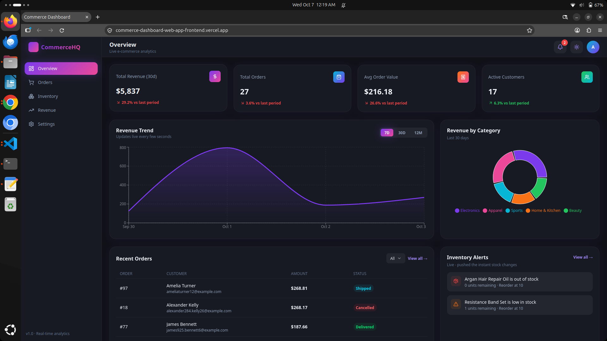
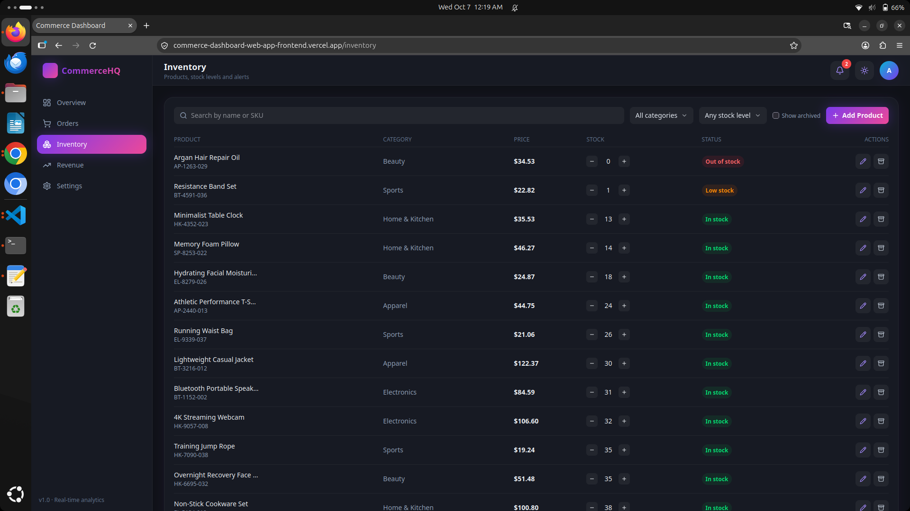
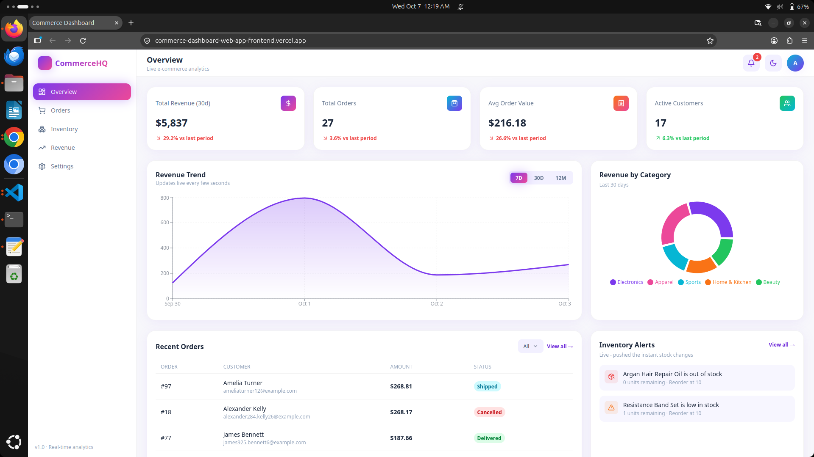

# Commerce Dashboard

A full-stack, production-ready commerce administration dashboard built with **React 19, Redux Toolkit state management, Node.js, Express, PostgreSQL, JWT authentication, Socket.IO, Docker, Supabase, and Vercel**.

The application provides a centralized interface for managing products, inventory, orders, revenue, administrators, store settings, and realtime inventory notifications.

The project was developed with a focus on **real database-backed functionality, secure authentication, responsive UI, realtime updates, containerized local development, and production deployment**.

---
## Table of Contents

1. [Live Demo](#live-demo)
2. [Features](#features)
   - [Dashboard Overview](#dashboard-overview)
   - [Inventory Management](#inventory-management)
   - [Order Management](#order-management)
   - [Revenue](#revenue)
   - [Realtime Notifications](#realtime-notifications)
   - [Authentication](#authentication)
   - [Admin Management](#admin-management)
   - [Store Settings](#store-settings)
   - [Responsive UI](#responsive-ui)
3.  [Tech Stack](#tech-stack)
4.  [Architecture](#architecture)
5.  [Authentication Architecture](#authentication-architecture)
6.  [Environment Variables](#environment-variables)
7.  [Database](#database)
8.  [Real Database-Backed Dashboard](#real-database-backed-dashboard)
9.  [Inventory Alert System](#inventory-alert-system)
10. [Realtime Architecture](#realtime-architecture)
11. [Docker](#docker)
12. [Local Development](#local-development)
13. [Production Architecture](#production-architecture)
14. [Production Deployment](#production-deployment)
15. [Production Security](#production-security)
16. [Project Structure](#project-structure)
17. [Main Application Routes](#main-application-routes)
18. [Backend API](#backend-api)
19. [Development Philosophy](#development-philosophy)
20. [Development Tools](#development-tools)
21. [What This Project Demonstrates](#what-this-project-demonstrates)
22. [Portfolio Highlights](#portfolio-highlights)
24. [License](#license)
25. [Author](#author)
26. [Project](#project)

---

## Live Demo


### Frontend

**https://commerce-dashboard-web-app-frontend.vercel.app/**

### Backend API

**https://commerce-dashboard-web-app.vercel.app/**

### Backend Health Check

**https://commerce-dashboard-web-app.vercel.app/api/health**











---

## Features

### Dashboard Overview

- Real-time commerce overview
- Database-backed statistics
- Order statistics
- Revenue information
- Inventory information
- Customer statistics
- Low-stock product alerts
- Realtime notification updates

### Inventory Management

- View products from PostgreSQL
- Product categories
- Stock quantity tracking
- Reorder levels
- Low-stock detection
- Inventory alerts
- Add and manage products
- Responsive inventory interface

### Order Management

- View orders
- Order status tracking
- Customer information
- Order item information
- Order totals
- Database-backed order data

Supported order statuses include:

```text
pending
processing
shipped
delivered
cancelled
```

### Revenue

- Database-backed revenue information
- Order-based calculations
- Revenue visualization
- Commerce performance overview

### Realtime Notifications

The application uses **Socket.IO** for realtime functionality.

Realtime functionality includes:

- Inventory alert updates
- Notification state updates
- Realtime server events
- Periodic realtime updates

### Authentication

Authentication is implemented using:

- JWT access tokens
- Refresh tokens
- HTTP cookies
- Protected backend routes
- Admin authentication
- Session refresh
- Logout functionality

### ‍ Admin Management

The backend supports administrator management functionality including:

- Administrator accounts
- Roles and permissions
- Protected admin operations

### Store Settings

The dashboard includes database-backed store settings and configuration management.

### Responsive UI

The frontend is designed to work across:

- Desktop
- Tablet
- Mobile

The interface uses responsive Tailwind CSS layouts and mobile-friendly tables, forms, navigation, and controls.

---

## Tech Stack

## Frontend

- React 19
- Vite
- Redux Toolkit
- React Router
- Tailwind CSS v4
- Socket.IO Client

## Backend

- Node.js
- Express
- PostgreSQL
- `pg`
- JWT
- Refresh Tokens
- Socket.IO
- REST APIs

## Database

- PostgreSQL
- Supabase PostgreSQL
- Database migrations
- Seed data
- Relational data model

## DevOps & Deployment

- Docker
- Docker Compose
- Git
- GitHub
- Vercel
- Supabase

---

## Architecture

The production application uses the following architecture:

```text
                         ┌──────────────────────────┐
                         │        User Browser      │
                         └────────────┬─────────────┘
                                      │
                                      ▼
                    ┌─────────────────────────────────┐
                    │        Vercel Frontend          │
                    │                                 │
                    │ React + Vite + Redux Toolkit    │
                    │ Tailwind CSS + Socket.IO Client │
                    └───────────────┬─────────────────┘
                                    │
                          HTTPS / REST / Socket.IO
                                    │
                                    ▼
                    ┌─────────────────────────────────┐
                    │         Vercel Backend          │
                    │                                 │
                    │ Node.js + Express               │
                    │ JWT Authentication              │
                    │ REST API + Socket.IO            │
                    └───────────────┬─────────────────┘
                                    │
                                    │ PostgreSQL
                                    ▼
                    ┌─────────────────────────────────┐
                    │       Supabase PostgreSQL       │
                    │                                 │
                    │ admins                          │
                    │ customers                       │
                    │ products                        │
                    │ orders                          │
                    │ order_items                     │
                    │ inventory_alerts                │
                    │ refresh_tokens                  │
                    │ store_settings                  │
                    └─────────────────────────────────┘
```

---

## Authentication Architecture

The application uses a JWT-based authentication system.

The authentication flow is:

```text
User
 │
 │ Login credentials
 ▼
Frontend
 │
 │ POST /api/auth/login
 ▼
Express Backend
 │
 │ Validate credentials
 │
 │ Generate access token
 │
 │ Generate refresh token
 ▼
Frontend
 │
 ├── Access token
 │
 └── Refresh token cookie
```

Protected API requests use the authenticated access token.

When the access token needs to be refreshed, the application can use the refresh-token flow rather than requiring the administrator to log in again.

Logout invalidates the authentication session and removes the associated authentication state.

---

## Environment Variables

Environment variables are used to keep credentials and environment-specific configuration outside the source code.

## Frontend

The frontend uses:

```env
VITE_API_URL=https://your-backend-domain/api
VITE_SOCKET_URL=https://your-backend-domain
```

For local development:

```env
VITE_API_URL=http://localhost:5000/api
VITE_SOCKET_URL=http://localhost:5000
```

> `VITE_*` variables are intentionally available to the browser. They should therefore contain public configuration such as API URLs, not passwords, database credentials, or JWT secrets.

---

## Backend

The backend uses PostgreSQL and authentication environment variables:

```env
PGHOST=
PGPORT=
PGDATABASE=
PGUSER=
PGPASSWORD=

JWT_SECRET=

CORS_ORIGIN=
```

Example local configuration:

```env
PGHOST=localhost
PGPORT=5433
PGDATABASE=commerce_dashboard
PGUSER=commerce_admin
PGPASSWORD=your-local-password

JWT_SECRET=your-local-development-secret

CORS_ORIGIN=http://localhost:5173
```

Production credentials should be configured through the hosting provider's environment-variable system.


---

## Database

The application uses PostgreSQL as its primary relational database.

Production uses **Supabase PostgreSQL**.

The database contains the following primary tables:

```text
admins
customers
inventory_alerts
order_items
orders
products
refresh_tokens
store_settings
```

### Main relationships

```text
customers
    │
    └── orders
           │
           └── order_items
                  │
                  └── products
```

Administrators authenticate through:

```text
admins
   │
   └── refresh_tokens
```

Inventory notifications are represented through:

```text
products
   │
   └── inventory_alerts
```

---

## Real Database-Backed Dashboard

The dashboard does not rely on hard-coded demonstration statistics.

Dashboard information is calculated from PostgreSQL data.

Examples include:

- Product counts
- Customer counts
- Order counts
- Revenue
- Inventory quantities
- Low-stock products
- Inventory alerts

This allows the dashboard to reflect actual database state rather than static frontend values.

---

## Inventory Alert System

Products use a configurable reorder level.

The default low-stock threshold is:

```text
10 units
```

A product can trigger an inventory alert when its available stock reaches or falls below its configured reorder level.

The application uses database-backed inventory alerts and Socket.IO to support realtime notification behavior.

---

## Realtime Architecture

Socket.IO is used to provide realtime communication between the frontend and backend.

The architecture is:

```text
                    ┌───────────────┐
                    │    Backend    │
                    │   Socket.IO   │
                    └───────┬───────┘
                            │
                       WebSocket
                            │
                            ▼
                    ┌───────────────┐
                    │   Frontend    │
                    │ Socket.IO     │
                    │    Client     │
                    └───────────────┘
```

Realtime functionality is used for application events such as inventory notifications and notification state updates.

---

## Docker

Docker is used for local backend and PostgreSQL development.

The local development environment can run:

```text
PostgreSQL
    +
Express Backend
```

using Docker Compose.

The project also contains a backend Dockerfile suitable for containerized deployments.

---

## Local Development

## Prerequisites

Install:

- Node.js
- npm
- Docker
- Docker Compose
- Git

---

## 1. Clone the repository

```bash
git clone https://github.com/saqlainyaqoob/commerce-dashboard-web-app.git
```

Enter the project:

```bash
cd commerce-dashboard-web-app
```

---

## Start PostgreSQL and Backend with Docker

From the project root:

```bash
sudo docker compose up -d
```

Check running containers:

```bash
sudo docker ps
```

The local services are configured to run approximately as:

```text
PostgreSQL → localhost:5433
Backend    → localhost:5000
```

---

## Backend Setup

Enter the backend directory:

```bash
cd backend
```

Install dependencies:

```bash
npm install
```

For development:

```bash
npm run dev
```

For production-style local execution:

```bash
npm start
```

The backend API is available at:

```text
http://localhost:5000
```

Health check:

```text
http://localhost:5000/api/health
```

---

## Frontend Setup

Open another terminal and enter the frontend directory:

```bash
cd frontend
```

Install dependencies:

```bash
npm install
```

Start the Vite development server:

```bash
npm run dev
```

The frontend will normally be available at:

```text
http://localhost:5173
```

---

## Local Development Architecture

```text
Browser
   │
   ▼
React + Vite
localhost:5173
   │
   │ REST / Socket.IO
   ▼
Express Backend
localhost:5000
   │
   │ PostgreSQL
   ▼
Docker PostgreSQL
localhost:5433
```

---

## Production Architecture

Production separates the frontend, backend, and database services.

```text
Browser
   │
   ▼
Vercel
React Frontend
   │
   │ HTTPS
   ▼
Vercel
Node.js / Express Backend
   │
   │ PostgreSQL
   ▼
Supabase
PostgreSQL Database
```

This separation allows each part of the application to be deployed and managed independently.

---

## Production Deployment

## Frontend

The React/Vite frontend is deployed using Vercel.

Production URL:

```text
https://commerce-dashboard-web-app-frontend.vercel.app
```

Frontend environment variables:

```env
VITE_API_URL=https://commerce-dashboard-web-app.vercel.app/api
VITE_SOCKET_URL=https://commerce-dashboard-web-app.vercel.app
```

---

## Backend

The Node.js/Express backend is deployed using Vercel.

Production URL:

```text
https://commerce-dashboard-web-app.vercel.app
```

The backend connects to the production Supabase PostgreSQL database using environment variables.

---

## Database

Production PostgreSQL is hosted by Supabase.

The backend uses PostgreSQL environment variables to connect to the Supabase database.

Database credentials are never stored in the repository.

---

## Production Security

The project follows several security practices:

- JWT-based authentication
- Refresh-token authentication
- Protected API routes
- Environment-based secrets
- Database credentials stored outside source control
- Production CORS configuration
- `.env` files excluded from Git
- No production credentials committed to the repository
- Admin authentication
- Protected administrator functionality

Sensitive variables such as:

```text
JWT_SECRET
PGPASSWORD
```

must never be exposed in frontend code.

---

## Project Structure

```text
commerce-dashboard-web-app/
│
├── backend/
│   ├── config/
│   ├── controllers/
│   ├── middleware/
│   ├── routes/
│   ├── services/
│   ├── scripts/
│   ├── Dockerfile
│   ├── package.json
│   └── server.js
│
├── frontend/
│   ├── src/
│   │   ├── components/
│   │   ├── pages/
│   │   ├── features/
│   │   ├── services/
│   │   ├── store/
│   │   └── ...
│   ├── public/
│   ├── package.json
│   └── ...
│
├── docker-compose.yml
├── .gitignore
├── README.md
└── ...
```

---

## Main Application Routes


| Route        | Page      | Description                                                                        |
| ------------ | --------- | ---------------------------------------------------------------------------------- |
| `/login`     | Login     | Public login page using bcrypt + JWT authentication.                               |
| `/`          | Overview  | KPI cards, revenue chart, category breakdown, recent orders, and inventory alerts. |
| `/orders`    | Orders    | Search, filtering, pagination, order details, line items, and status updates.      |
| `/inventory` | Inventory | Product management, search/filtering, stock adjustments, and inventory alerts.     |
| `/revenue`   | Revenue   | Revenue trends, category breakdown, best-selling products, and top customers.      |
| `/settings`  | Settings  | Store configuration and operational settings.                                      |
| `/profile`   | Profile   | Administrator profile management and password changes.                             |


> Protected application routes require a valid JWT access token, while the `/login` route remains publicly accessible.

The application uses protected routes to prevent unauthorized access to administrative functionality.


---

## Backend API

The Express backend is organized into API route groups including:

```text
/api/auth
/api/analytics
/api/orders
/api/inventory
/api/admin
/api/settings
```

A health endpoint is available at:

```text
/api/health
```

Example response:

```json
{
  "status": "ok",
  "time": "2026-10-06T13:49:00.011Z"
}
```

---

## Development Philosophy

The project was built around several principles:

### Real data over mock data

Dashboard information is retrieved from PostgreSQL rather than relying on hard-coded frontend statistics.

### Separation of concerns

Frontend, backend, and database responsibilities are separated.

### Environment-specific configuration

Local development and production use different environment configurations without requiring changes to application logic.

### Reusable components

Common UI elements such as navigation, dropdowns, notification panels, tables, and alerts are implemented as reusable React components.

### Responsive design

The dashboard is designed for desktop and mobile environments.

### Incremental development

Features and fixes are implemented without unnecessarily replacing working architecture or realtime functionality.

---

## Development Tools

The project was developed using:

- Git
- GitHub
- Docker
- Docker Compose
- VS Code / terminal development tools
- Postman/API testing
- Supabase
- Vercel


---

## What This Project Demonstrates

This project demonstrates practical full-stack development skills across the complete application lifecycle:

```text
Frontend Development
        ↓
State Management
        ↓
REST API Development
        ↓
Authentication
        ↓
Database Design
        ↓
Realtime Communication
        ↓
Docker Development
        ↓
Cloud Database
        ↓
Cloud Deployment
        ↓
Production Configuration
```

It demonstrates experience working with both application development and deployment infrastructure rather than only building a frontend interface.

---

## ‍ Portfolio Highlights

For portfolio and hiring-manager review, this project demonstrates experience with:

- Full-stack React development
- REST API development with Express
- PostgreSQL database design
- Supabase managed PostgreSQL
- JWT authentication
- Refresh-token authentication
- Role-based administrative functionality
- Redux Toolkit state management
- Socket.IO realtime communication
- Responsive Tailwind CSS interfaces
- Docker and Docker Compose
- Cloud deployment with Vercel
- Production environment configuration
- Database-backed analytics
- Inventory management
- Order management
- Realtime notifications
- Git and GitHub workflow

---

## License

This project is intended as a portfolio and demonstration project.


## Author

**Saqlain Yaqoob**

GitHub:

```text
https://github.com/saqlainyaqoob
```

Project repository:

```text
https://github.com/saqlainyaqoob/commerce-dashboard-web-app
```

---

## Project

If you are reviewing this repository, the live production application is available here:

**https://commerce-dashboard-web-app-frontend.vercel.app/**